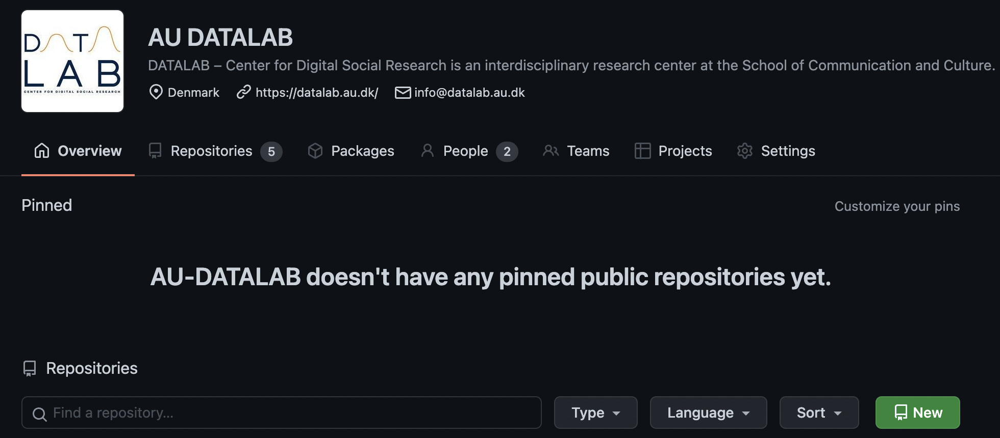
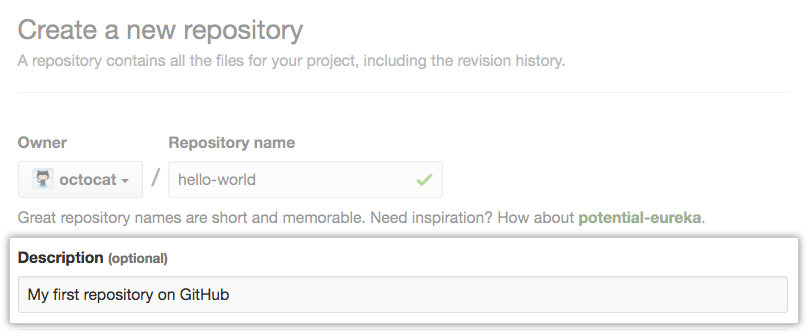
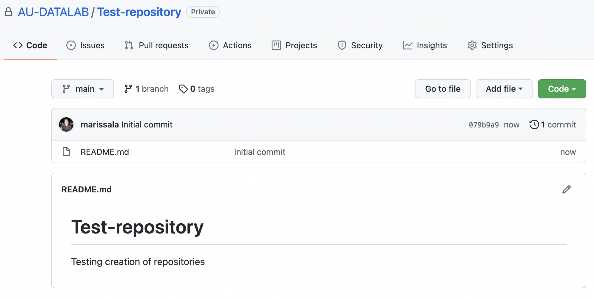
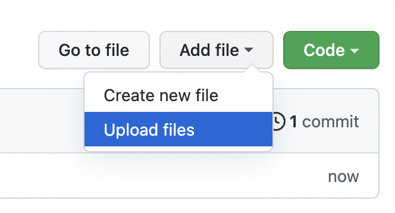
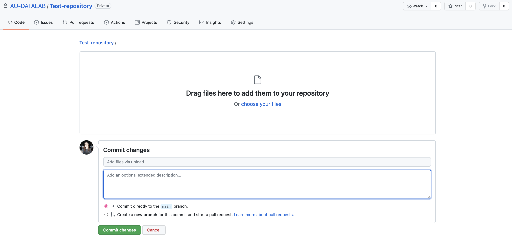

# How to use AU-DATALAB for employees and collaborators
This document includes both a step-by-step guideline on how to upload your codes to this organisation, how to become a contributor, 
and what are the best practices to keep in mind.

## 1. Uploading your code
You've done or are currently working on a paper that requires programming, and you want to make the codes public on GitHub for DATALAB. 
These guidelines begin with the assumption that you have a folder on your work machine that includes (at least the initial) codes for your project.

### 1.1 Creating a repository on GitHub
#### **Step 1.** On AU-DATALAB's frontpage, click on the "New" button to create a new repository.
A repository is essentially a folder similar to the one on your work machine: it has a descriptive name and contains the necessary codes of the project.

#### **Step 2.** Type a short, descriptive name for your repository.
If the project is under a larger project, use the abbreviation of the larger project in the start, e.g. "NGI-Twitter-hashtags".
The titles of repositories are _not_ case-sensitive and they can be changed later on.

#### **Step 3.** Optionally, add a description of your repository.
For example, "Code for deep dive in hashtags of the Danish Twitter for Next Generation Internet report D1.8"

#### **Step 4.** Choose a repository visibility.
Public repositories are seen by anyone on GitHub, and private ones are only seen by the member users of AU-DATALAB.
**Your code should not include any sensitive data, no access tokens to APIs, no passwords and usernames in any parts of the code**.
If your codes include such information, **they should still not be uploaded as private repositories.**
Instead, you'll need to remove any sensitive data, replace those parts with placeholders, and upload code as appropriate afterwards.

The privacy status of the repository can be changed afterwards, but if you make a private repository public afterwards, all of the history of changes will be visible to anyone.
If there is sensitive information in a private repository, it's better to delete it and upload as a public repository with sensitive information removed before uploading.

#### **Step 5.** Select Initialize this repository with a README.
It's good practice to fill the README with information on how others can navigate the codes you have uploaded, how to install your codes if relevant, what the folders and codes contain.
For more info on how to make a good README, visit [Free Code Camp](https://www.freecodecamp.org/news/how-to-write-a-good-readme-file/) and [Makeareadme.com](https://www.makeareadme.com/).

#### **Step 6.** Click Create repository.

Congratulations! You've successfully created your first repository, and initialized it with a README file.

### 1.2 Uploading your code
Now that you have made a repository on AU-DATALAB, and initialized it with a README (this you can fill in immediately or after uploading the codes), it is time to upload your code.

There are two ways to upload your code:
1. By using the GitHub website
2. Using command line with push and pull commands

The current overview will cover option 1, for a guide on option 2, check out [GitHub Docs](https://docs.github.com/en/github/importing-your-projects-to-github/importing-source-code-to-github/adding-an-existing-project-to-github-using-the-command-line)
or this [Medium article](https://medium.com/@sauravbhagat_10426/how-to-upload-code-to-github-6db1c8ff56aa)

#### **Step 1.** Now that you've initialized your repository with a README, you should see something similar:

#### **Step 2.** On the right side you'll see "Add file" --> "Upload files".

**This brings you to something similar:**

#### **Step 3.** Click on the "choose your files" link and move inside the folder on your computer, select all the files at once.
At the bottom you can write a commit message that describes what you have uploaded, e.g "initial commit", or "updated website features".
Leave the description part empty and click on "Commit changes"

Congratulations! Your files have now been uploaded and you should be able to see them in the repository!

**NOTE**: If you wish to **make a folder** under your repository, use [this guide](https://github.community/t/add-a-folder/2304)

## 2. Best practices
